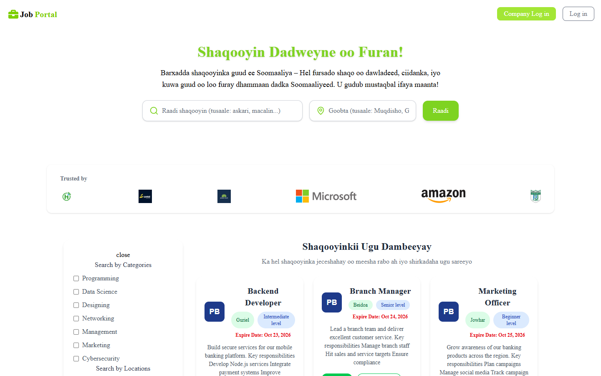
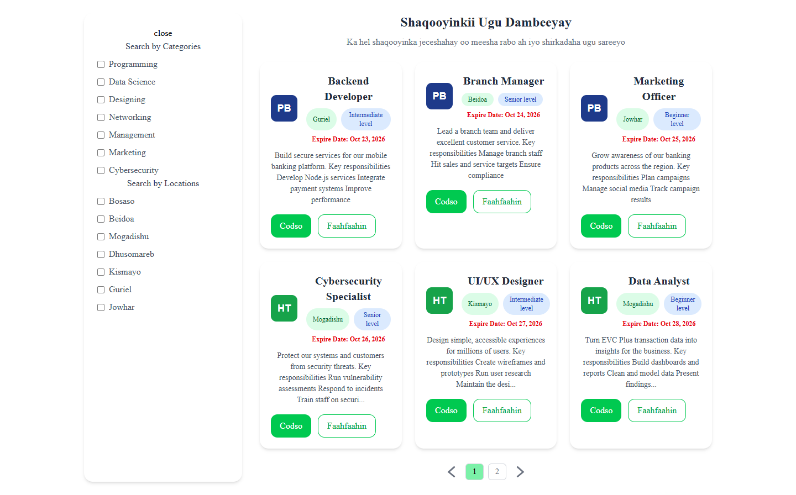
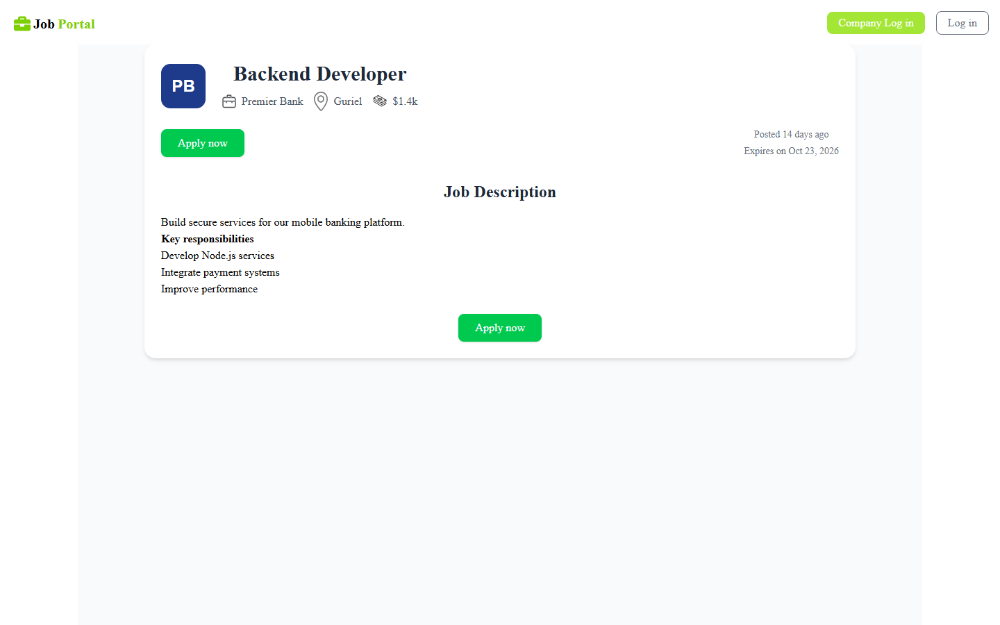
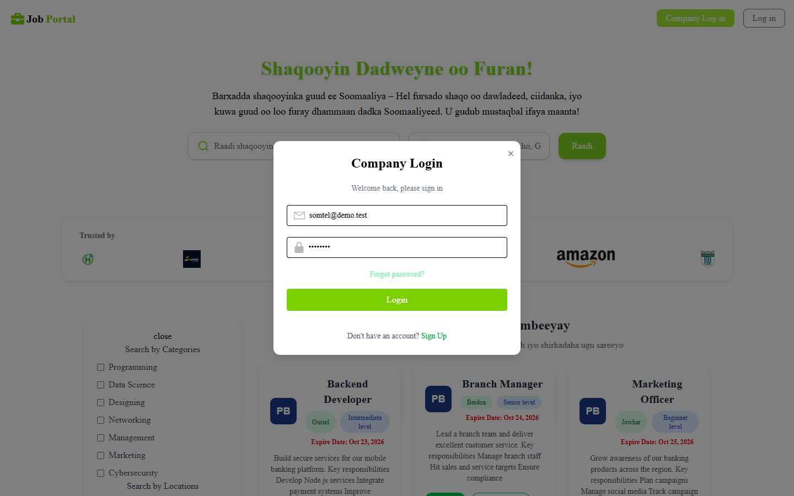
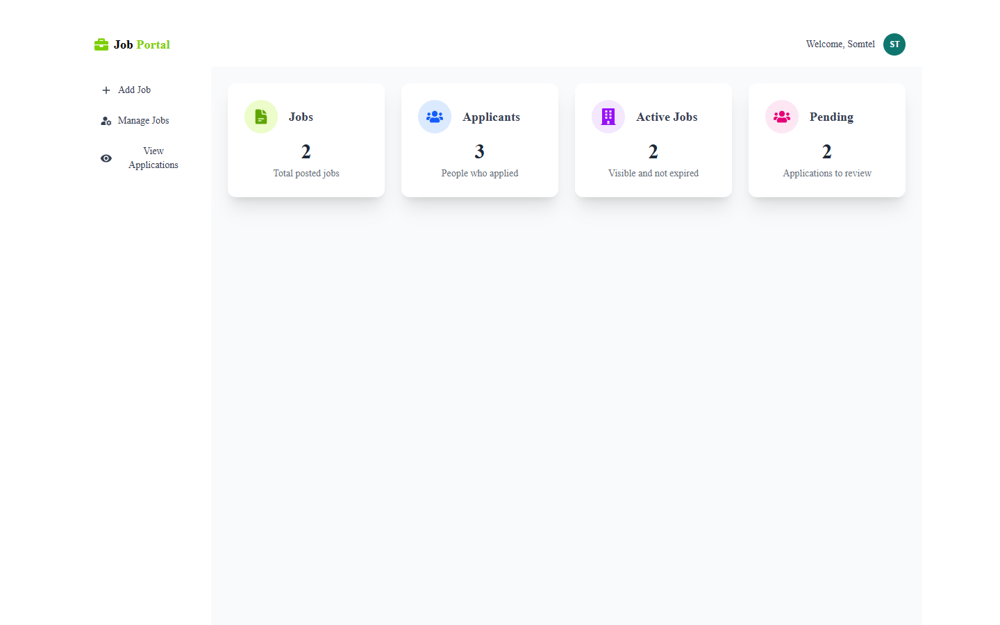
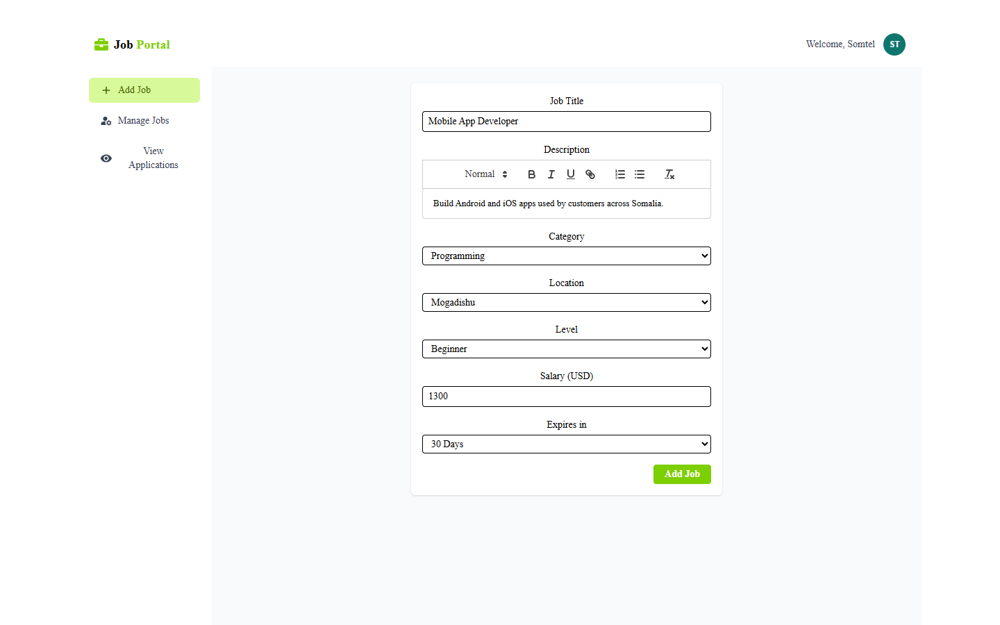
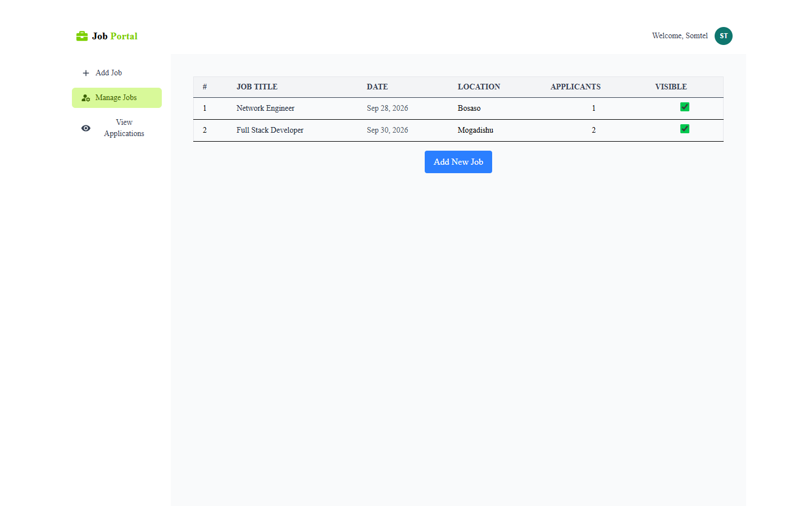
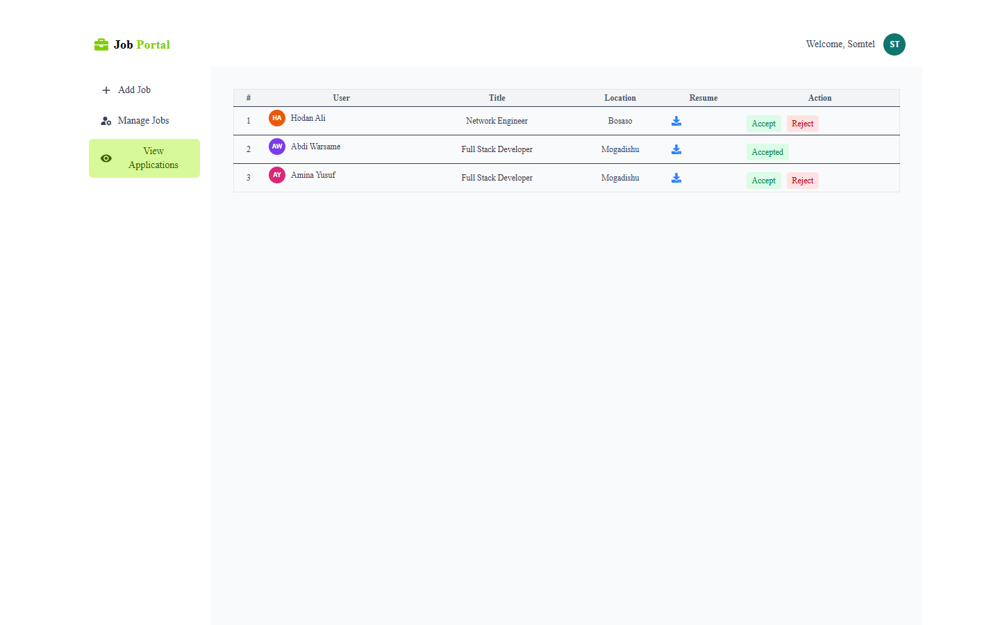
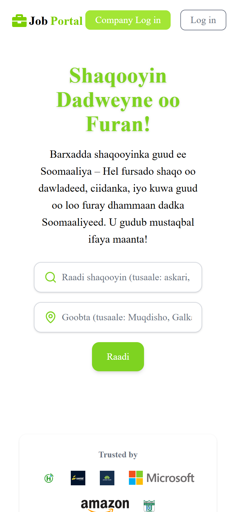
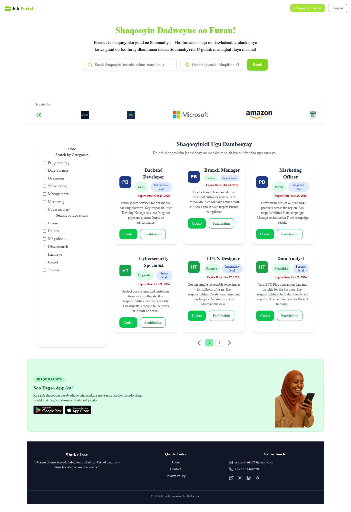

# job-portal
job portal web Application for job seekers and companies

## Running locally

Requires Node.js 20+.

1. Install dependencies:
   ```bash
   cd server && npm install
   cd ../client && npm install
   ```
2. Create `server/.env` and `client/.env` from the `.env.example` files next to them.
3. Start a local MongoDB (no install needed; data is kept in `server/.mongo-data`):
   ```bash
   cd server && npm run db
   ```
   To use MongoDB Atlas instead, set `MONGODB_URI` to your cluster's connection string and skip this step.
4. Load demo data (companies, jobs, applicants):
   ```bash
   cd server && npm run seed
   ```
   Demo company login: `somtel@demo.test` / `demo1234`
5. Start the API and the web app in two terminals:
   ```bash
   cd server && npm start
   ```
   ```bash
   cd client && npm run dev
   ```
   Open http://localhost:5173

## Screenshots

### Home page


### Job listings


### Job details


### Company login


### Company dashboard


### Add a job


### Manage jobs


### View applications


### Mobile view


### Full home page

